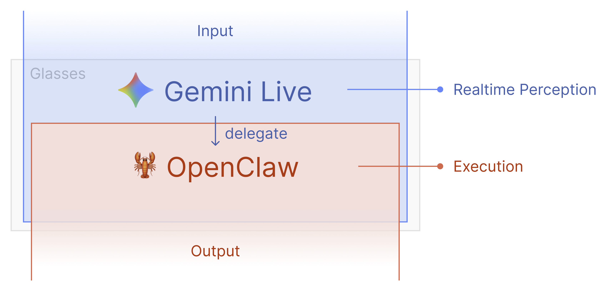

# VisionClaw


A real-time AI assistant for Meta Ray-Ban smart glasses. See what you see, hear what you say, and take actions on your behalf -- all through voice.


Built on [Meta Wearables DAT SDK](https://github.com/facebook/meta-wearables-dat-ios) (iOS) / [DAT Android SDK](https://github.com/nichochar/openclaw) (Android) + [Gemini Live API](https://ai.google.dev/gemini-api/docs/live) + custom MCP server (optional).

**Supported platforms:** iOS (iPhone) and Android (Pixel, Samsung, etc.)

## What It Does

Put on your glasses, tap the AI button, and talk:

- **"What am I looking at?"** -- Gemini sees through your glasses camera and describes the scene
- **"Add milk to my shopping list"** -- delegates to your MCP server, which executes the action via your custom tools
- **"Send a message to John saying I'll be late"** -- routes through MCP tools to WhatsApp/Telegram/iMessage
- **"Search for the best coffee shops nearby"** -- web search via MCP tools, results spoken back

The glasses camera streams at configurable FPS (1-10, default 3) to Gemini for visual context, while audio flows bidirectionally in real-time. Both audio and video can be toggled independently at runtime.

## How It Works



```
Meta Ray-Ban Glasses (or phone camera)
       |
       | video frames + mic audio
       v
iOS / Android App (this project)
       |
       | JPEG frames (configurable fps) + PCM audio (16kHz)
       v
Gemini Live API (WebSocket)
       |
       |-- Audio response (PCM 24kHz) --> App --> Speaker
       |-- Tool calls (dynamic) -------> App --> MCP Server (via Cloudflare Tunnel)
       |                                              |
       |                                              v
       |                                      Your custom tools:
       |                                      web search, messaging,
       |                                      smart home, notes, etc.
       |                                              |
       |<---- Tool response (text) <----- App <-------+
       |
       v
  Gemini speaks the result
```

**Key pieces:**
- **Gemini Live** -- real-time voice + vision AI over WebSocket (native audio, not STT-first)
- **MCP Server** (optional) -- your custom server implementing the [Model Context Protocol](https://modelcontextprotocol.io), exposed via Cloudflare Tunnel or similar. Tools are fetched dynamically at session start and declared individually to Gemini.
- **Phone mode** -- test the full pipeline using your phone camera instead of glasses
- **WebRTC streaming** -- share your glasses POV live to a browser viewer
- **Runtime toggles** -- independently enable/disable sending audio and video frames to Gemini without disconnecting

---

## Quick Start (iOS)

### 1. Clone and open

```bash
git clone https://github.com/sseanliu/VisionClaw.git
cd VisionClaw/samples/CameraAccess
open CameraAccess.xcodeproj
```

### 2. Add your secrets

Copy the example file and fill in your values:

```bash
cp CameraAccess/Secrets.swift.example CameraAccess/Secrets.swift
```

Edit `Secrets.swift` with your [Gemini API key](https://aistudio.google.com/apikey) (required) and optional MCP server/WebRTC config.

### 3. Build and run

Select your iPhone as the target device and hit Run (Cmd+R).

### 4. Try it out

**Without glasses (iPhone mode):**
1. Tap **"Start on iPhone"** -- uses your iPhone's back camera
2. Tap the **AI button** to start a Gemini Live session
3. Talk to the AI -- it can see through your iPhone camera

**With Meta Ray-Ban glasses:**

First, enable Developer Mode in the Meta AI app:

1. Open the **Meta AI** app on your iPhone
2. Go to **Settings** (gear icon, bottom left)
3. Tap **App Info**
4. Tap the **App version** number **5 times** -- this unlocks Developer Mode
5. Go back to Settings -- you'll now see a **Developer Mode** toggle. Turn it on.


Then in VisionClaw:
1. Tap **"Start Streaming"** in the app
2. Tap the **AI button** for voice + vision conversation

---

## Quick Start (Android)

### 1. Clone and open

```bash
git clone https://github.com/sseanliu/VisionClaw.git
```

Open `samples/CameraAccessAndroid/` in Android Studio.

### 2. Configure GitHub Packages (DAT SDK)

The Meta DAT Android SDK is distributed via GitHub Packages. You need a GitHub Personal Access Token with `read:packages` scope.

1. Go to [GitHub > Settings > Developer Settings > Personal Access Tokens](https://github.com/settings/tokens) and create a **classic** token with `read:packages` scope
2. In `samples/CameraAccessAndroid/local.properties`, add:

```properties
github_token=YOUR_GITHUB_TOKEN
```

> **Tip:** If you have the `gh` CLI installed, you can run `gh auth token` to get a valid token. Make sure it has `read:packages` scope -- if not, run `gh auth refresh -s read:packages`.
>
> **Note:** GitHub Packages requires authentication even for public repositories. The 401 error means your token is missing or invalid.

### 3. Add your secrets

```bash
cd samples/CameraAccessAndroid/app/src/main/java/com/meta/wearable/dat/externalsampleapps/cameraaccess/
cp Secrets.kt.example Secrets.kt
```

Edit `Secrets.kt` with your [Gemini API key](https://aistudio.google.com/apikey) (required) and optional OpenClaw/WebRTC config.

### 4. Build and run

1. Let Gradle sync in Android Studio (it will download the DAT SDK from GitHub Packages)
2. Select your Android phone as the target device
3. Click Run (Shift+F10)

> **Wireless debugging:** You can also install via ADB wirelessly. Enable **Wireless debugging** in your phone's Developer Options, then pair with `adb pair <ip>:<port>`.

### 5. Try it out

**Without glasses (Phone mode):**
1. Tap **"Start on Phone"** -- uses your phone's back camera
2. Tap the **AI button** (sparkle icon) to start a Gemini Live session
3. Talk to the AI -- it can see through your phone camera

**With Meta Ray-Ban glasses:**

Enable Developer Mode in the Meta AI app (same steps as iOS above), then:
1. Tap **"Start Streaming"** in the app
2. Tap the **AI button** for voice + vision conversation

---

## Setup: MCP Server (Optional)

A custom MCP (Model Context Protocol) server gives Gemini the ability to take real-world actions: send messages, search the web, manage lists, control smart home devices, and more. Without it, Gemini is voice + vision only.

The iOS app communicates with your MCP server using the standard [Streamable HTTP transport](https://modelcontextprotocol.io/specification/2025-06-18/basic/transports) (JSON-RPC 2.0 over HTTP POST to a `/mcp` endpoint).

### How it works

1. At session start, the app calls `initialize` + `tools/list` on your MCP server
2. The returned tools are declared individually to Gemini as function declarations
3. When the user asks Gemini to do something, Gemini picks the right tool and calls it
4. The app forwards the call to your MCP server via `tools/call`
5. The result is sent back to Gemini, which speaks it to the user

### 1. Build your MCP server

Implement a server that exposes the MCP Streamable HTTP transport at a `/mcp` endpoint. At minimum, support:
- `initialize` -- handshake
- `tools/list` -- return your available tools
- `tools/call` -- execute a tool and return results

### 2. Expose it publicly

Use [Cloudflare Tunnel](https://developers.cloudflare.com/cloudflare-one/connections/connect-networks/) or similar to make your local server reachable from the internet:

```bash
cloudflared tunnel --url http://localhost:3000
```

This gives you a public URL like `https://your-tunnel-id.trycloudflare.com`.

### 3. Configure the app

**iOS** -- In `Secrets.swift`:
```swift
static let mcpServerURL = "https://your-tunnel-id.trycloudflare.com"
static let mcpAuthToken = "your-optional-auth-token"
```

> The app also has an in-app Settings screen where you can change these values at runtime without editing source code.

### 4. Verify

Test your server is reachable:

```bash
curl -X POST https://your-tunnel-id.trycloudflare.com/mcp \
  -H "Content-Type: application/json" \
  -d '{"jsonrpc":"2.0","id":1,"method":"initialize","params":{"protocolVersion":"2025-06-18","capabilities":{},"clientInfo":{"name":"test","version":"1.0"}}}'
```

Now when you talk to the AI, it can execute tasks through your MCP tools.

### SSE Notifications (Optional)

The app can also receive proactive notifications from your MCP server via Server-Sent Events (SSE). Send JSON-RPC notifications with method `notifications/message` and a `content` string in params. These will be spoken by Gemini through the glasses. Enable this in Settings > Proactive Notifications.

---

## Architecture

### Key Files (iOS)

All source code is in `samples/CameraAccess/CameraAccess/`:

| File | Purpose |
|------|---------|
| `Gemini/GeminiConfig.swift` | API keys, model config, system prompt, FPS config |
| `Gemini/GeminiLiveService.swift` | WebSocket client for Gemini Live API (dynamic tool declarations) |
| `Gemini/AudioManager.swift` | Mic capture (PCM 16kHz) + audio playback (PCM 24kHz) |
| `Gemini/GeminiSessionViewModel.swift` | Session lifecycle, tool call wiring, audio/video toggles, transcript state |
| `MCP/MCPModels.swift` | JSON-RPC 2.0 types, MCP tool definitions, Gemini tool call models |
| `MCP/MCPBridge.swift` | MCP Streamable HTTP client (initialize, tools/list, tools/call) |
| `MCP/MCPToolCallRouter.swift` | Routes Gemini tool calls to MCP server with circuit breaker |
| `MCP/MCPEventClient.swift` | SSE client for proactive notifications from MCP server |
| `Settings/SettingsManager.swift` | UserDefaults persistence for all settings |
| `Settings/SettingsView.swift` | In-app settings UI (MCP config, FPS slider, audio/video toggles) |
| `iPhone/IPhoneCameraManager.swift` | AVCaptureSession wrapper for iPhone camera mode |
| `WebRTC/WebRTCClient.swift` | WebRTC peer connection + SDP negotiation |
| `WebRTC/SignalingClient.swift` | WebSocket signaling for WebRTC rooms |

### Key Files (Android)

All source code is in `samples/CameraAccessAndroid/app/src/main/java/.../cameraaccess/`:

| File | Purpose |
|------|---------|
| `gemini/GeminiConfig.kt` | API keys, model config, system prompt |
| `gemini/GeminiLiveService.kt` | OkHttp WebSocket client for Gemini Live API |
| `gemini/AudioManager.kt` | AudioRecord (16kHz) + AudioTrack (24kHz) |
| `gemini/GeminiSessionViewModel.kt` | Session lifecycle, tool call wiring, UI state |
| `openclaw/ToolCallModels.kt` | Tool declarations, data classes |
| `openclaw/OpenClawBridge.kt` | OkHttp HTTP client for OpenClaw gateway |
| `openclaw/ToolCallRouter.kt` | Routes Gemini tool calls to OpenClaw |
| `phone/PhoneCameraManager.kt` | CameraX wrapper for phone camera mode |
| `webrtc/WebRTCClient.kt` | WebRTC peer connection (stream-webrtc-android) |
| `webrtc/SignalingClient.kt` | OkHttp WebSocket signaling for WebRTC rooms |
| `settings/SettingsManager.kt` | SharedPreferences with Secrets.kt fallback |

### Audio Pipeline

- **Input**: Phone mic -> AudioManager (PCM Int16, 16kHz mono, 100ms chunks) -> Gemini WebSocket
- **Output**: Gemini WebSocket -> AudioManager playback queue -> Phone speaker
- **iOS iPhone mode**: Uses `.voiceChat` audio session for echo cancellation + mic gating during AI speech
- **iOS Glasses mode**: Uses `.videoChat` audio session (mic is on glasses, speaker is on phone -- no echo)
- **Android**: Uses `VOICE_COMMUNICATION` audio source for built-in acoustic echo cancellation

### Video Pipeline

- **Glasses**: DAT SDK video stream (24fps) -> throttle to configurable FPS (1-10, default 3) -> JPEG (50% quality) -> Gemini
- **Phone**: Camera capture (30fps) -> throttle to configurable FPS -> JPEG -> Gemini
- **Send Frames toggle**: Can be disabled at runtime to stop sending frames to Gemini without stopping camera capture

### Tool Calling

Gemini Live supports function calling. The iOS app dynamically fetches tool definitions from your MCP server at session start and declares each one individually to Gemini:

1. App calls `tools/list` on MCP server → gets list of available tools with names, descriptions, and input schemas
2. Each tool is declared to Gemini as a `functionDeclaration` in the setup message
3. User says "Add eggs to my shopping list"
4. Gemini speaks "Sure, adding that now" (verbal acknowledgment before tool call)
5. Gemini sends `toolCall` with the appropriate tool name and arguments
6. `MCPToolCallRouter` sends `tools/call` (JSON-RPC 2.0) to MCP server
7. MCP server executes the tool and returns the result
8. Result returns to Gemini via `toolResponse`
9. Gemini speaks the confirmation

A circuit breaker stops tool calls after 3 consecutive failures to avoid degraded loops.

### WebRTC Live Streaming

Share your glasses POV in real-time to a browser viewer with bidirectional audio and video.

1. Tap the **Live** button in the app
2. The app connects to a signaling server and gets a 6-character room code
3. Share the code -- the viewer opens the server URL in a browser and enters it
4. WebRTC peer connection is established (SDP + ICE via the signaling server)
5. Media flows peer-to-peer: glasses video to browser, browser camera back to iOS PiP

**Key details:**
- **Signaling server**: Node.js + WebSocket, located at `samples/CameraAccess/server/` -- serves the browser viewer and relays SDP/ICE
- **NAT traversal**: Google STUN servers + ExpressTURN relay (fetched from `/api/turn`)
- **Video**: 24 fps, 2.5 Mbps max bitrate
- **Background handling**: 60-second grace period for iOS app backgrounding -- room stays alive for reconnection
- **Constraint**: Cannot run simultaneously with Gemini Live (audio device conflict)

For full details, see [`samples/CameraAccess/CameraAccess/WebRTC/README.md`](samples/CameraAccess/CameraAccess/WebRTC/README.md).

---

## Requirements

### iOS
- iOS 17.0+
- Xcode 15.0+
- Gemini API key ([get one free](https://aistudio.google.com/apikey))
- Meta Ray-Ban glasses (optional -- use iPhone mode for testing)
- Custom MCP server (optional -- for agentic actions, exposed via Cloudflare Tunnel or similar)

### Android
- Android 14+ (API 34+)
- Android Studio Ladybug or newer
- GitHub account with `read:packages` token (for DAT SDK)
- Gemini API key ([get one free](https://aistudio.google.com/apikey))
- Meta Ray-Ban glasses (optional -- use Phone mode for testing)
- OpenClaw on your Mac (optional -- for agentic actions, Android only)

---

## Troubleshooting

### General

**Gemini doesn't hear me** -- Check that microphone permission is granted. The app uses aggressive voice activity detection -- speak clearly and at normal volume.

**MCP server unreachable** -- Verify your Cloudflare Tunnel is running and the URL is correct. Test with `curl -X POST <your-url>/mcp`. Check the in-app Settings for the correct Server URL. The status pill in the app shows "MCP: <name>" when connected, "MCP Off" when unreachable.

**Tools not showing up** -- The app fetches tools via `tools/list` at session start. If your MCP server returns an empty list or errors, Gemini won't have any tools available. Check the Xcode console for `[MCP]` log messages.

### iOS-specific

**"Gemini API key not configured"** -- Add your API key in Secrets.swift or in the in-app Settings.

**Echo/feedback in iPhone mode** -- The app mutes the mic while the AI is speaking. If you still hear echo, try turning down the volume.

### Android-specific

**Gradle sync fails with 401 Unauthorized** -- Your GitHub token is missing or doesn't have `read:packages` scope. Check `local.properties` for `gpr.user` and `gpr.token`. Generate a new token at [github.com/settings/tokens](https://github.com/settings/tokens).

**Gemini WebSocket times out** -- The Gemini Live API sends binary WebSocket frames. If you're building a custom client, make sure to handle both text and binary frame types.

**Audio not working** -- Ensure `RECORD_AUDIO` permission is granted. On Android 13+, you may need to grant this permission manually in Settings > Apps.

**Phone camera not starting** -- Ensure `CAMERA` permission is granted. CameraX requires both the permission and a valid lifecycle.

For DAT SDK issues, see the [developer documentation](https://wearables.developer.meta.com/docs/develop/) or the [discussions forum](https://github.com/facebook/meta-wearables-dat-ios/discussions).

## License

This source code is licensed under the license found in the [LICENSE](LICENSE) file in the root directory of this source tree.
